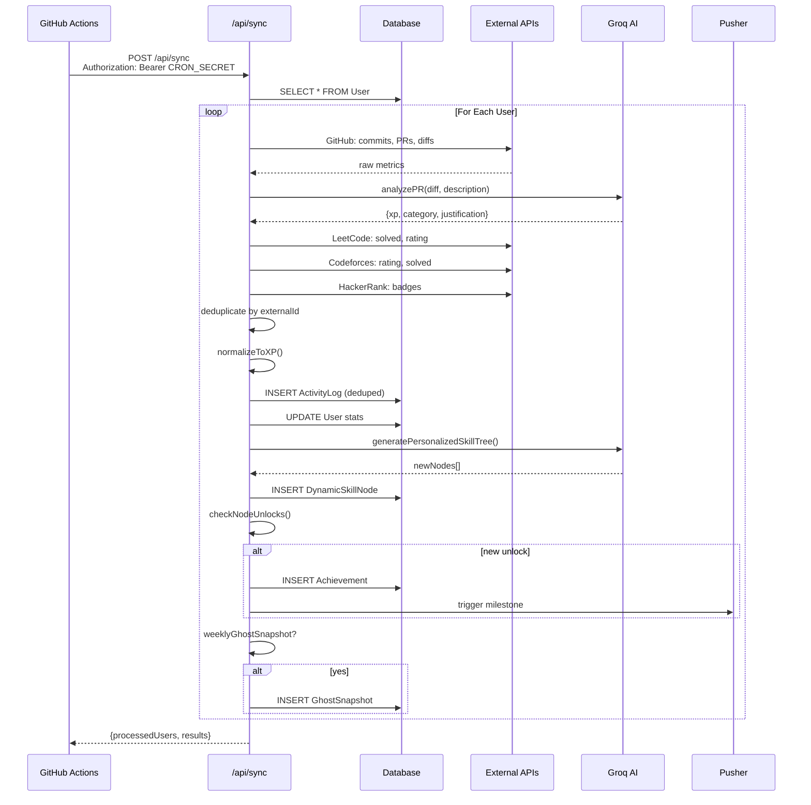
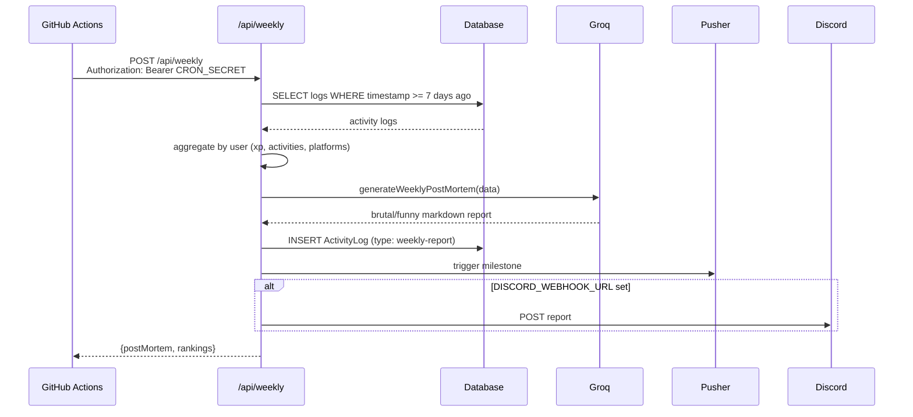
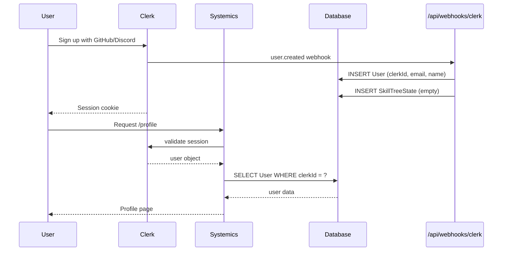
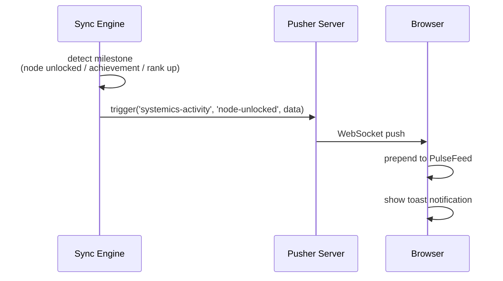
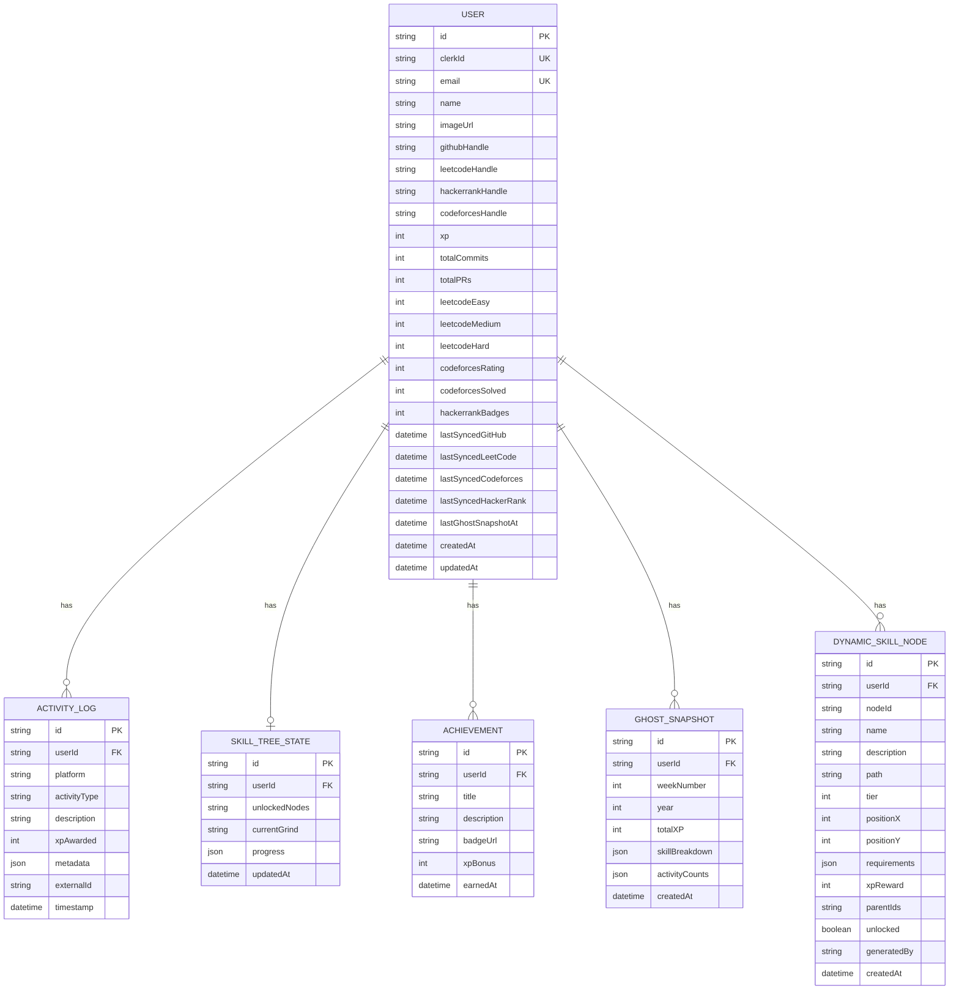
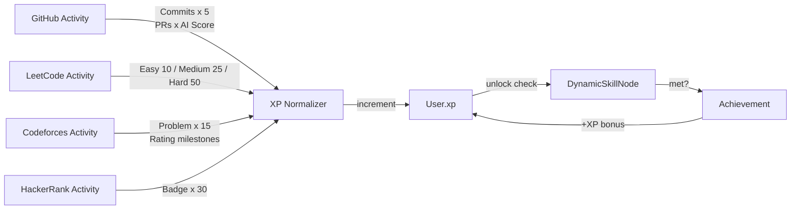

# Systemics Architecture

## Overview

Systemics is a unified, AI-augmented competitive leaderboard built as a single Next.js 14 application. It aggregates developer activity from GitHub, LeetCode, Codeforces, and HackerRank, normalizes it into a shared "Systemics XP" currency, and presents it through interactive visualizations including AI-generated skill trees and real-time social feeds.

## Design Principles

1. **Single Deployable Unit**: Everything lives in one Next.js app. No microservices, no separate workers.
2. **Serverless-First**: Database (Neon Postgres), compute (Vercel Functions), and cron (GitHub Actions) are all serverless.
3. **AI-Augmented, Not AI-Dependent**: Groq enhances scoring and personalization, but the app functions with heuristics if AI is unavailable.
4. **Event-Driven Social Layer**: Pusher provides real-time milestones without polling.

---

## High-Level Architecture

```mermaid
graph TB
    subgraph "Client"
        WEB[Browser]
        WEB --> DASH[Dashboard /]
        WEB --> LB[Leaderboard /leaderboard]
        WEB --> PROF[Profile /profile]
    end

    subgraph "Next.js App Router"
        DASH --> API1[API Routes]
        LB --> API1
        PROF --> API1

        API1 --> AUTH[Clerk Middleware]
        API1 --> SYNC[/api/sync POST]
        API1 --> WEEKLY[/api/weekly POST]
        API1 --> SKILL[/api/skilltree GET]
        API1 --> RADAR[/api/radar GET]
        API1 --> LEAD[/api/leaderboard GET]
        API1 --> PROF_API[/api/profile GET/PUT]
        API1 --> WEBHOOK[/api/webhooks/clerk POST]
    end

    subgraph "AI Layer"
        SYNC --> GROQ[Groq llama3-70b-8192]
        WEEKLY --> GROQ
        GROQ --> PR[PR Complexity Scoring]
        GROQ --> TREE[Skill Tree Generation]
        GROQ --> POST[Weekly Post-Mortem]
    end

    subgraph "External APIs"
        SYNC --> GH[GitHub GraphQL]
        SYNC --> LC[LeetCode GraphQL]
        SYNC --> CF[Codeforces REST]
        SYNC --> HR[HackerRank Scraper]
    end

    subgraph "Data Layer"
        API1 --> DB[(Neon Postgres)]
        DB --> USER[User Table]
        DB --> ACT[ActivityLog Table]
        DB --> DYN[DynamicSkillNode Table]
        DB --> ACH[Achievement Table]
        DB --> GHOST[GhostSnapshot Table]
    end

    subgraph "Real-Time"
        SYNC --> PUSHER[Pusher Server]
        WEEKLY --> PUSHER
        PUSHER --> FEED[The Pulse Feed]
    end

    subgraph "Automation"
        GH_ACTIONS[GitHub Actions] --> SYNC
        GH_ACTIONS2[GitHub Actions] --> WEEKLY
    end
```

---

## Request Flows

### 1. Data Sync (Every 6 Hours)

Triggered by `.github/workflows/sync.yml` hitting `/api/sync` with `CRON_SECRET`.



### 2. Weekly Post-Mortem (Every Sunday)

Triggered by `.github/workflows/weekly.yml`.



### 3. User Authentication Flow



### 4. Real-Time Milestone Flow



---

## Database Schema



---

## Component Architecture

### Frontend Components

```
Dashboard (/)
├── The Pulse (PulseFeed.tsx)
│   └── Pusher client subscription
│   └── Milestone event rendering
├── AI Skill Radar (SkillRadar.tsx)
│   └── Recharts RadarChart
│   └── Ghost mode toggle
│   └── /api/radar fetch
├── Leaderboard Preview (LeaderboardTable.tsx)
│   └── /api/leaderboard fetch
│   └── Progress bars
└── Tech-Tree (SkillTree.tsx)
    └── React Flow canvas
    └── Dynamic node rendering
    └── Node detail sidebar

Leaderboard (/leaderboard)
└── LeaderboardTable (full page)

Profile (/profile)
├── Platform Handles (editable)
├── Stats Grid
├── Sync Now button
└── Achievements list
```

### API Routes

| Route | Method | Auth | Description |
|---|---|---|---|
| `/api/sync` | POST | CRON_SECRET | 6-hour data sync engine |
| `/api/weekly` | POST | CRON_SECRET | Sunday post-mortem |
| `/api/skilltree` | GET | Public (Clerk auto) | Dynamic tree nodes |
| `/api/radar` | GET | Public | Skill radar data |
| `/api/leaderboard` | GET | Public | Global rankings |
| `/api/profile` | GET/PUT | Clerk | User profile |
| `/api/ghost` | GET | Public | Ghost snapshots |
| `/api/webhooks/clerk` | POST | Svix webhook | User provisioning |

### Library Modules

```
src/lib/
├── ai/
│   ├── groq.ts                 # PR analysis, categorization, post-mortem
│   ├── skillRadar.ts           # 5-axis aggregation with heuristics
│   ├── ghost.ts                # Weekly snapshot CRUD
│   └── skillTreeGenerator.ts   # AI-generated dynamic nodes
├── fetchers/
│   ├── github.ts               # GitHub GraphQL API
│   ├── leetcode.ts             # LeetCode unofficial GraphQL
│   ├── codeforces.ts           # Codeforces REST API
│   └── hackerrank.ts           # HackerRank scraper
├── skilltree/
│   ├── definitions.ts          # Static fallback nodes
│   └── unlock.ts               # Node unlock verification
├── xp/
│   └── normalize.ts            # XP scoring tables
├── pusher/
│   └── server.ts               # Server-side triggers
└── prisma.ts                   # Database client singleton
```

---

## Data Flow: XP Calculation



---

## Security Considerations

1. **CRON_SECRET**: All automated endpoints (`/api/sync`, `/api/weekly`) require a bearer token. Store in GitHub Actions secrets and `.env`.
2. **Clerk Webhook**: Verify Svix signatures to prevent spoofed user creation.
3. **Database URLs**: Use connection pooling URLs for app, direct URLs for migrations.
4. **GitHub Token**: Use a fine-grained PAT with minimal scopes (read:user, read:repo).
5. **Groq API Key**: Server-side only. Never expose to client.

---

## Performance Optimizations

1. **Aggregated Stats**: User table stores cached totals (commits, PRs, etc.) to avoid counting logs for leaderboard queries.
2. **Batch Heuristics**: Skill radar uses keyword matching instead of per-log Groq calls (reduces API usage by ~90%).
3. **Deduplication**: ActivityLog has `@@unique([userId, externalId])` to prevent double-counting PRs.
4. **Selective Sync**: Only platforms with `handle` fields are queried.

---

## Error Handling Strategy

| Layer | Strategy |
|---|---|
| External APIs | Try/catch with zero-value fallbacks. Log warnings. |
| Groq AI | Try/catch with default values (XP=30, category='Backend'). |
| Database | Prisma errors bubble up as 500s with message. |
| Pusher | Fire-and-forget. Log errors but don't block sync. |
| Webhooks | Return 400 on verification failure. |

---

## Future Extensions

- **Custom Paths**: Users can create their own grind paths (e.g., "Game Dev", "Security Researcher").
- **Team Battles**: Squad vs squad weekly competitions.
- **GitLab/Bitbucket**: Additional Git provider fetchers.
- **Streak Tracking**: Daily/weekly consistency bonuses.
- **Mobile App**: React Native with same API layer.
