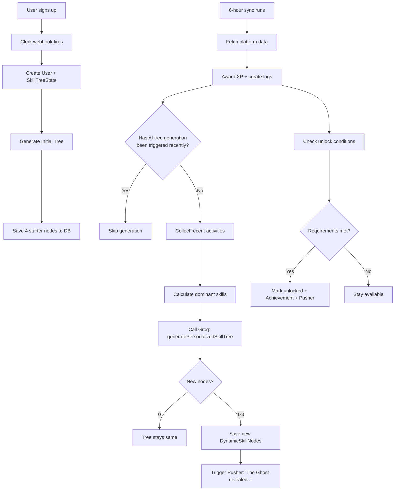
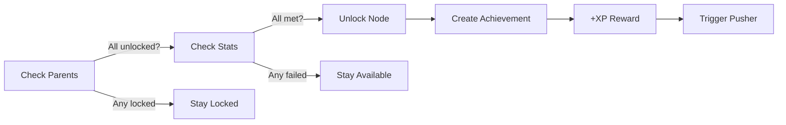

# AI Skill Tree System

How Systemics generates personalized, evolving skill trees for each user.

---

## Philosophy

Traditional skill trees are static: every player sees the same nodes in the same order. Systemics breaks this mold.

**Your skill tree grows with you.**

- Grind LeetCode hard problems? The tree spawns algorithm and systems nodes.
- Ship React components? Frontend paths emerge.
- Contribute to infrastructure? DevOps branches appear.
- Go full-stack? Architecture nodes unlock.

The AI (Groq `openai/gpt-oss-120b`) analyzes your last 20 activities and aggregate stats to generate 0-3 new nodes per sync cycle.

---

## Data Model

### DynamicSkillNode

Stored per-user in the database:

```
id          : cuid
userId      : references User
nodeId      : stable string (e.g., "se-concurrency-master")
name        : display name
path        : grind path (e.g., "Systems Engineer")
tier        : depth in tree (0 = root, increases downward)
positionX   : canvas X coordinate
positionY   : canvas Y coordinate
requirements: JSON object with unlock conditions
xpReward    : XP awarded on unlock
parentIds   : array of parent nodeIds (prerequisites)
unlocked    : boolean
generatedBy : "ai" or "system"
createdAt   : timestamp
```

**Key constraint**: `@@unique([userId, nodeId])` — each user can only have one node with a given ID.

---

## Tree Generation Pipeline



---

## Initial Tree (All Users)

Every new user starts with the same 4 nodes:

| nodeId | Name | Path | Tier | Requirements |
|---|---|---|---|---|
| `core-junior-dev` | Junior Dev | Core | 0 | total_xp: 0 |
| `fw-dom-surgeon` | DOM Surgeon | Frontend Wizard | 1 | skill_xp_Frontend: 50 |
| `se-concurrency-master` | Concurrency Master | Systems Engineer | 1 | leetcode_hard: 5 |
| `ds-sql-sage` | SQL Sage | Data Scientist | 1 | leetcode_tags_Database: 10 |

These are created by `generateInitialSkillTree()` and saved with `generatedBy: 'system'`.

---

## AI Generation Prompt

The prompt sent to Groq includes:

1. **User Stats**: Total XP, commits, PRs, LeetCode solved by difficulty, Codeforces rating, dominant skills
2. **Recent Activities**: Last 20 activity logs with platform, type, description, XP
3. **Existing Nodes**: All current nodes with name, path, tier, unlock status

**AI Rules** (embedded in prompt):
- Only generate nodes that feel NATURAL for the user's activity
- Names should be MEMORABLE and slightly exaggerated
- Requirements should be ACHIEVABLE but require effort (1.5-3x current stats)
- No duplicate concepts
- Position nodes to avoid overlap (spread X, increase Y per tier)
- Return empty array if nothing new is warranted

**Example AI Output**:

```json
{
  "newNodes": [
    {
      "nodeId": "se-kernel-whisperer",
      "name": "Kernel Whisperer",
      "description": "Deep understanding of OS internals and low-level systems",
      "path": "Systems Engineer",
      "tier": 2,
      "positionX": 500,
      "positionY": 400,
      "requirements": { "leetcode_hard": 15, "skill_xp_Backend": 300 },
      "xpReward": 350,
      "parentIds": ["se-concurrency-master"],
      "justification": "User has solved 12 hard problems and gained significant backend XP"
    }
  ]
}
```

---

## Unlock System

### Prerequisites

A node can be unlocked only if:
1. **All parent nodes are unlocked**: Every ID in `parentIds` must be in the unlocked set
2. **Stat requirements met**: The `requirements` JSON object specifies thresholds

### Requirement Types

| Key | Checks | Example |
|---|---|---|
| `total_xp` | User.xp | `{ "total_xp": 1000 }` |
| `leetcode_hard` | User.leetcodeHard | `{ "leetcode_hard": 10 }` |
| `github_prs` | User.totalPRs | `{ "github_prs": 20 }` |
| `github_commits` | User.totalCommits | `{ "github_commits": 100 }` |
| `codeforces_rating` | User.codeforcesRating | `{ "codeforces_rating": 1500 }` |
| `codeforces_solved` | User.codeforcesSolved | `{ "codeforces_solved": 100 }` |
| `hackerrank_badges` | User.hackerrankBadges | `{ "hackerrank_badges": 5 }` |
| `skill_xp_{Category}` | Sum of XP in category | `{ "skill_xp_Backend": 200 }` |

### Unlock Flow



---

## UI Rendering

### React Flow Canvas

The skill tree renders as an interactive node graph:

- **Unlocked nodes**: Solid color (path-specific), full opacity
- **Available nodes**: Colored border, full opacity
- **Locked nodes**: Gray, 50% opacity

### Node Detail Sidebar

Clicking a node shows:
- Name + status badge
- Path + "AI Generated" badge (if `generatedBy === 'ai'`)
- Description
- XP reward
- Requirements list

### Color Coding

| Path | Color |
|---|---|
| Core | Purple `#a855f7` |
| Frontend Wizard | Blue `#3b82f6` |
| Systems Engineer | Red `#ef4444` |
| Data Scientist | Green `#22c55e` |
| Fullstack Legend | Amber `#f59e0b` |
| DevOps Architect | Cyan `#06b6d4` |

---

## Examples: Trees by Playstyle

### The Algorithm Grinder

User: 50 LeetCode hards, 2000 rating

```
Junior Dev
├── Concurrency Master (unlocked)
│   ├── Kernel Whisperer (AI generated)
│   │   └── Distributed Architect (AI generated)
│   └── Binary Search Sensei (AI generated)
└── SQL Sage (locked)
```

### The Frontend Wizard

User: 30 React PRs, 500 commits

```
Junior Dev
├── DOM Surgeon (unlocked)
│   ├── React Artisan (AI generated)
│   │   ├── Fullstack Legend (AI generated)
│   │   └── Design System Sage (AI generated)
│   └── CSS Wizard (AI generated)
└── Concurrency Master (locked)
```

### The Jack of All Trades

User: Balanced across all platforms

```
Junior Dev
├── DOM Surgeon (unlocked)
├── Concurrency Master (unlocked)
├── SQL Sage (unlocked)
└── The Architect (AI generated, requires 1000 XP)
```

---

## Performance

- **Tree size**: Capped at ~50 nodes per user (AI generates max 3 per sync, 4 syncs/day = 12/day, but most days generate 0)
- **Query speed**: `DynamicSkillNode` has `@@index([userId])` for fast retrieval
- **AI cost**: One Groq call per user per sync (when generation triggers). ~20 tokens per call.

---

## Future Improvements

- **Path Suggestions**: AI recommends which path to focus on based on strengths
- **Node Branching**: Nodes could have multiple children, creating a true DAG
- **Visual Evolution**: Unlocked nodes could animate or glow
- **Community Nodes**: Popular community-created nodes suggested to similar users
- **Seasonal Trees**: Special limited-time nodes during hackathons or events
